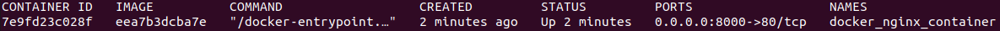

# Terraform Docker Nginx Server

This repository provisions an Nginx server with Terraform.

Initialize the project:

```sh
terraform init
```

Provision the Nginx server:

```sh
terraform apply
```

Navigate to http://localhost:8000 in your browser.




image--------------

To stop the container:

```sh
terraform destroy
```
